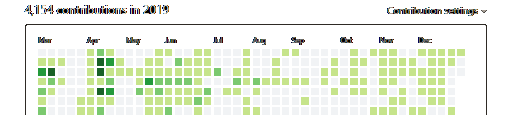
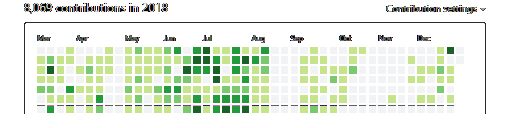
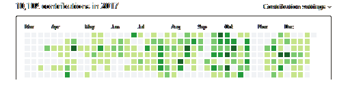

Since 2014 to 2020 I worked for <a href="http://www.zspace.com" target="_blank">zSpace</a> Inc.
as a principle software engineer and technical lead/architect of system software team.

My team and I are responsible for multiple IR cameras head tracking,
stylus and screen angle IMU data-stream processing and integration, poses triangulation, and delivery of 3D data to
end-user applications via C API.

User facing applications are usually written using Unity 3D, OpenGL/DDX and other GL frameworks.

System software also supports h/w manufacturing process, cameras calibration, overall components testing. 

Major achivements:
 - [x] instrumental role in rearchitecting and reimplemting of complete IMU, IR Cameras triangulation pipeline for two systems that are build by the company and shipped to customers. Generated hundreds of millions of dollars revenue for the company. 
 - [x] invented and implemented new FPGA friendly algorithms for tracking controller hardware. 
 - [x] lead embedded Android AOSP initative that resulted in succefull 3D VR laptop design, verification, development and production. 

During my course of duty I have:
 - [x] re-implemented ~~250,000~~ lines of C++ code (Windows only, R&D quality, ridden with STL/ATL/MFC)
 - [x] implemented same functionality in ~30KLoC of pure C99 portable code
 - [x] reworked ~~30,000~~+ lines of OpenCV based C++ triangulation algorithm to **~3,000** LoCs 
 - [x] improved binary code footprint from 500MB to approximately 5MB
 - [x] improved performance from 97% of system CPU utilization to less then 5%
 - [x] reduced build time from 50 minutes to 2 minutes
 - [x] actively maintained several github source code repositories
 - [x] responsible for over 60 posix and Win32 projects
 - [x] performed several thousands commits per year and many hundreds code reviews
 - [x] developed new algorithms for high performance camera blobs detection 
 - [x] assisted porting those algorithms to FPGA
 - [x] developed real time Android Java and Android Native C h/w debug applications 
 - [x] developed real time (less then 5 microseconds) logging
 - [x] implemented native code for AWS S3 analytics data uploads/downloads 
 - [x] resolved problems with oversea hardware manufactures
 - [x] implemented posix complaint hardware tests on both Linux (Embedded Android) and Windows
 - [x] implemented some end user facing UI applications
 - [x] resolved problems with Microsoft and Google related to Windows and Android codebases
 - [x] contributed code to open source projects
 - [x] mentored junior developers
 - [x] actively collaborated and provided fixes for issues in other team high level projects
 - [x] contributed code to some open source projects
 - [x] rebuild Android ASOP codebase to a headless version for OEM AmLogic SoC from scratch resulting in reduction of size from 1GB to 100MB and boot time from 30 seconds to 6 seconds
 - [x] implemented FPGA friendly IR greyscale images compression algorithm for hand gesture recognition AI / neural network research  <a href="https://github.com/leok7v/bdgr/blob/master/bdgr.c" target="_blank">FPGA friendly Golomb Rice compression</a>

hardware used:

 *  TI Beagle Boards, Samsung XU4, Ordoid C1,C2, Amlogic 905X, Blackfin...
 *  OmniVision and Aptina camera sensors development boards

tools used:
 * bash, vi, make, gcc, clang, ld, printf
 * msvc (2008, 2012, 2017, 2019)
 * Android Studio
 * InteliJ Idea and ReSharper
 * common sense
 * Google sheets and Excel for statistical analysis and diagramming.
 
gihub contributions (commits): 

<section class="accordion">
  <input type="checkbox" name="collapse" id="handle1">
  

    <label for="handle1">zSpace demo video</label>
  

  

    

        <iframe width="280" height="153"  src="https://www.youtube.com/embed/-jsNH-H60io?rel=0&amp;autoplay=0&mute=1" 
         frameborder="0" allow="accelerometer; encrypted-media; gyroscope; picture-in-picture" allowfullscreen></iframe>    
    

  

</section>

